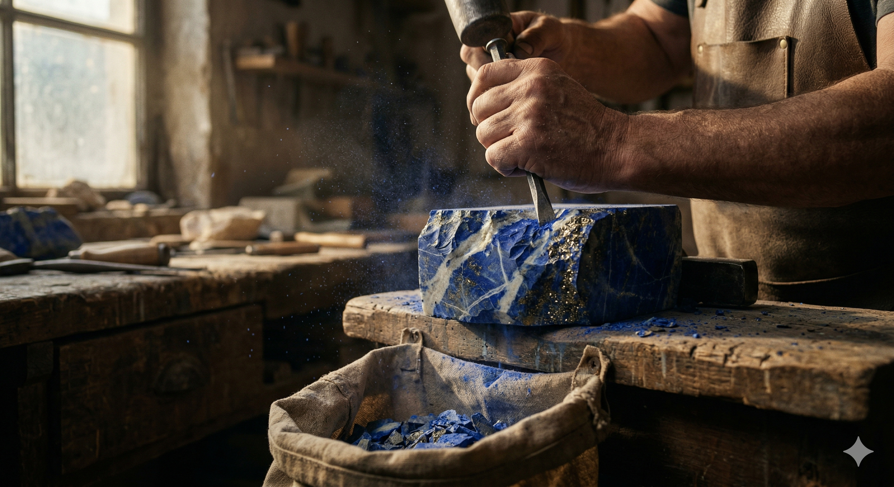
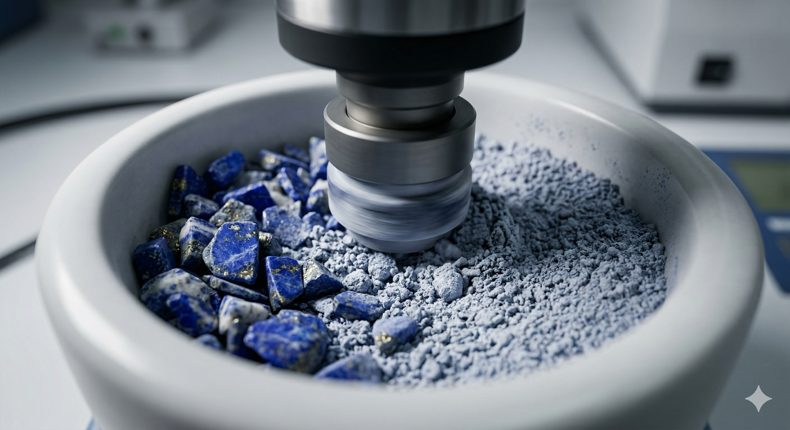
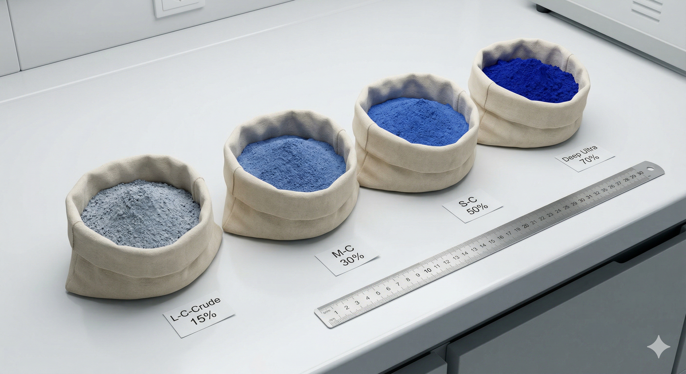
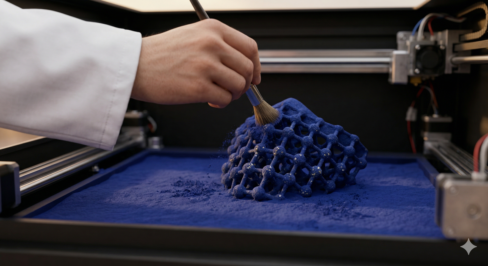

# Fernanda Cabezas

## Perfil

**Disciplina / formación:** Diseño industrial

**Qué hago hoy:**  Líder Tecnologías Aplicadas Industrial - Transformación Digital Industrial. Lidero y gestiono el programa de manufactura aditiva a nivel corporativo, a través de la colaboración con equipos multifuncionales y los encargados delas plantas , con el objetivo de asegurar la implementación, acelerar la adopción y maximizar el impacto de la tecnología en toda la organización. Ahora tengo interés con el vibe code con IA para generar aplicaciones

Actualmente me encuentro estudiando en el Magíster de Ciencias del Diseño donde estoy explorando nuevas tecnologías y realización de materia primas para Manufactura Aditiva por medio de biomateriales a través de revalorización de descartes (economía circular)

**Qué me gustaría aprender en este curso:**  programación web, vibe coding, que me sorprenda 

## Intereses

- Tecnología 4.0 y 5.0
- Diseño de Material y CAD CAM
- Economía Circular

## Una pregunta que me interesa explorar

¿Se puede reutilzar el remante de lapislázuli descartado por artesanos y minas como materia prima para manufactura aditiva?

## Algo que me inspira

## Links

- [Referencia 1](https://example.com)
- [Referencia 2](https://example.com)

> No es necesario publicar información personal que no quieras compartir. Este README será parte de un repositorio público durante el laboratorio.
